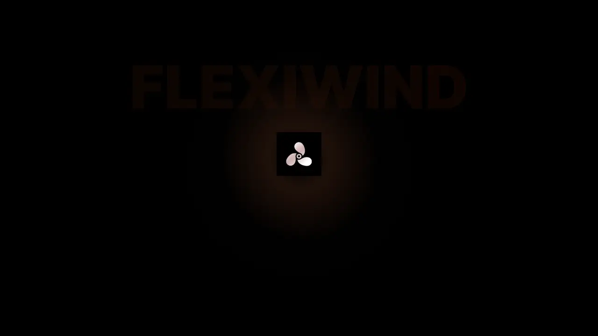

# Flexiwind

Beautifully crafted, accessible UI components for Laravel. Built with Tailwind CSS v4. Supports both Blade and Livewire. Shadcn-like and open source.

## Features

- **Beautifully crafted components**
- **Accessible by default**
- **Tailwind CSS v4**
- **Blade and Livewire support**
- **Shadcn-like ergonomics**
- **Open source**

## Status

This project is actively developed. Documentation and component examples will be added here.

## Contributing

Issues and pull requests are welcome. Please open an issue to discuss any major changes first.

