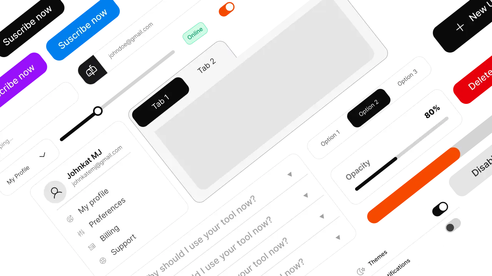

# Flexiwind

Flexiwind is a Laravel-first UI component system built with Blade, Livewire, and Tailwind CSS v4.
It focuses on semantic theming, reusable patterns, and practical integration into real app codebases.

## Highlights

- Blade + Livewire component workflows
- Tailwind CSS v4 token-driven styling
- Built-in theme architecture (colors, utilities, buttons)
- Accessible interaction patterns across core components
- Documentation playground for implementation guidance

## Requirements

- PHP `^8.2`
- Laravel `^12`
- Node.js + npm

## Quick Start

```bash
composer install
npm install
cp .env.example .env
php artisan key:generate
php artisan migrate
composer dev
```

App routes:
- Home: `/`
- Docs: `/docs`
- Components: `/components`

## Build and Test

```bash
npm run build
```

## Documentation

Core documentation lives in:
- `resources/views/content/docs`
- `resources/views/content/components`

Sidebar navigation metadata:
- `config/sidebar.php`

## Contributing

Please read:
- `CONTRIBUTING.md`
- `CODE_OF_CONDUCT.md`
- `SECURITY.md`

## License

MIT - see `LICENSE`.

## Buy Me a Coffee

Support the project:
[Buy me a coffee](https://johnkat-mj.mychariow.shop/prd_jue7tw)
